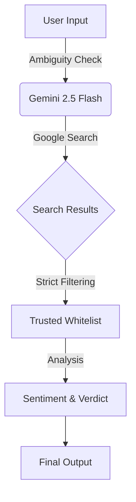

<div align="center">
  
  

  # 🛡️ Veritas
  ### Real-Time AI Fact-Checking Agent

  <p align="center">
    <a href="https://veritas-ai-eta.vercel.app/">
      
    </a>
  </p>

  <p align="center">
    
    
    
    
    
  </p>

  <br />
</div>

---

### 🧐 What is Veritas?

**Veritas** is a high-precision, AI-powered fact-checking tool designed to verify news headlines and claims in real-time. 

> Unlike standard AI chatbots that may hallucinate or cite unreliable sources, Veritas enforces a **strict RAG (Retrieval-Augmented Generation) architecture** that only validates claims against a curated whitelist of trusted global news agencies.

---

## 🚀 Key Features

| Feature | Description |
| :--- | :--- |
| ⚡ **Real-Time Grounding** | Uses **Google Gemini 2.5 Flash** + **Google Search** to fetch live data (no knowledge cutoff). |
| 🔒 **Strict Whitelist** | The core engine **programmatically filters** out sources not on the trusted list (e.g., blogs, social media). |
| 📊 **Transparent Verdicts** | Delivers clear outcomes: <br>✅ **Verified** <br>❌ **False** <br>⚠️ **Misleading** <br>❓ **Unverified** |
| 🧠 **Source Sentiment** | Analyzes each article to determine if it *Supports*, *Disputes*, or is *Neutral*. |
| 🚨 **Breaking News** | Automatically flags developing stories where facts may still be evolving. |

---

## 🛠️ Tech Stack

<div align="center">

| Frontend | AI & Logic | Styling |
| :---: | :---: | :---: |
| **React 19** | **Google Gemini 2.5 Flash** | **Tailwind CSS** |
| **TypeScript** | **Google Search Grounding** | **Lucide Icons** |
| **Vite** | **RAG Architecture** | **Glassmorphism UI** |

</div>

---

## 📦 Installation & Setup

<details>
<summary>Click to expand setup instructions</summary>

### Prerequisites
*   Node.js (v18 or higher)
*   A Google AI Studio API Key (Gemini)

### 1. Clone the repository
```bash
git clone https://github.com/the-AmanS/Veritas.git
cd Veritas
```

### 2. Install dependencies
```bash
npm install
```

### 3. Configure Environment Variables
Create a `.env.local` file in the root directory:
```env
# Get this key from https://aistudio.google.com/
VITE_GEMINI_API_KEY=your_actual_api_key_here
```

### 4. Run the development server
```bash
npm run dev
```

</details>

---

## 🧠 How It Works



1.  **User Input**: User enters a claim.
2.  **Ambiguity Check**: Client-side logic checks for vague inputs.
3.  **AI Investigation**: Gemini executes a **Google Search**.
4.  **Strict Filtering**: Sources NOT in `TRUSTED_DOMAINS` are discarded.
5.  **Verdict Generation**: AI matches consensus to a verdict type.

---

## 🔒 Trusted Sources Whitelist

<div align="center">
  
| Region | Sources |
| :--- | :--- |
| 🌍 **Global Wires** | Reuters, AP News, Bloomberg, AFP |
| 🇺🇸 **US Major** | NY Times, Washington Post, WSJ, NPR, PBS, USA Today, CNN |
| 🇬🇧 **International** | BBC, The Guardian, DW, France24, Al Jazeera, Nikkei Asia |
| 🔍 **Fact Checkers** | Snopes, PolitiFact, FactCheck.org |

</div>

*(See `constants.ts` for the full list)*

---

## ⚠️ Disclaimer

> Veritas is an educational project/prototype designed to demonstrate the potential of AI in fighting misinformation. While it uses strict sourcing protocols, no AI is infallible. **Always verify critical information from primary sources directly.**

---

<div align="center">

Made with ❤️ by [Aman Singh](https://github.com/the-AmanS)

</div>
